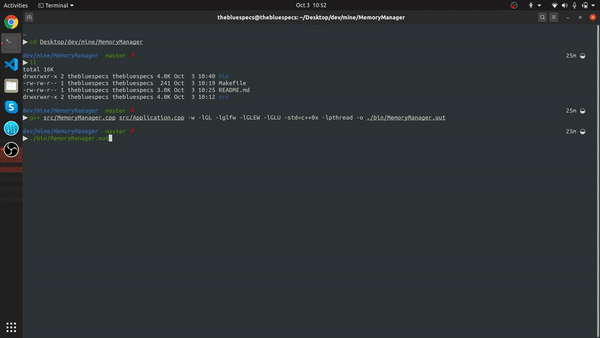

# MemoryManager
Memory manger with a visualisation.

  

## Implementation

### Algorithm
This solution byte-aligns the requested space in bytes and includes a 2 byte header
  The header contains a signature denoting an occupied block in 2 bits and the rest of 
  14 bits represent the size of the allocated memory block in bytes.
  The scanner jumps uses the size in the 14 bits as a cue to jump to the next block. If the next block
  is a free block, its size is compared with the requested size, if a match then it is allocated, else the scanning continues.
  
  Example :
  1. 4(int) bytes of memory are requested.
  2. The scanner starts with the byte. It compares the first byte to see if it a free block.
  3. If yes, then  it is checked whether it can accomodate 4 bytes of memory and 2 bytes of header.
  4. After that, its first two bits are made as the signature using bitwise operation **0xC0 | first byte** and
     rest of 14 bits are set as the size that is 4 in this case.
  5. The pointer to the third free byte (as the first two bytes are HEADER and size)is returned. 
  6. The scanner keeps going forward till there is an appropriate sized memory block available.
  7. If a free block is not found, or a free block with exact size is not found, an out of memory error is generated.

  Deallocation traversal is similar to that of allocation. Only in deallocation, the scanner finds out the size of the allocated block from the first 2 bytes (using bitwise operatin **0x3F & first byte**) and makes the size+header(2bytes) bytes to 0x0.

  For a free block, first two bits of header will be **00** and for a occupied block, it would be **11**

### Defragmentation
  Considered mutiple ways
  1. The scanner traverses the pool from the beginning when an allocation is provoked and tried to fit in the current requested block in fragmentated memory space if required space is less than available.(Implemented)
  2. Discussed with peers about sqaushing whenever a de-allocation occurs. This can be implemented with a hash map, where the key value pair is the {original_allocated_ptr, offset_ptr_after_squash}. The problem with this is the duplication of Keys when another allocation occurs at the memory later in the tasks.

### Visualisation.
  A very basic renderer to fit the need.
  OpenGL 3.3 has been used with core Profile. GLFW for the windowing. GLM for maths and matrices.
  TODO : Instance the rectangle strips instead of multiple draw calls.

### MultiThreading
This is a thread safe program which takes calls from multiple thread at the same time. There are multiple algothims to make this a smooth and collision free but for now POSIX type multi threading has been implemented. 

## Execution Information

Make sure to have all the libraries which are statically getting linked.

**BUIDLING**
  1. `mkdir build && cd build`
  2. `cmake ..`
  3. `make`

**RUN** :
`./demo`
